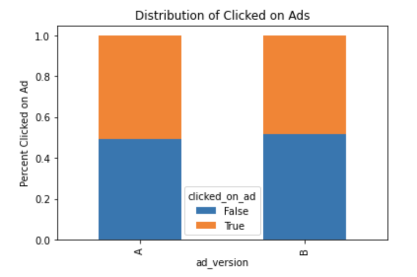
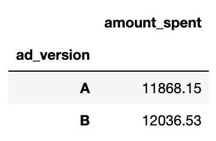

# Ad Campaign Testing

by Zachary Greenberg  

# Overview
The two worlds of Marketing and Sales go hand in hand. Often with great marketing, comes great sales. It can be a symbiotic relationship. A way to test your marketing strategy is to over different versions of your marketing ads and pin them against eachother. This will allow to you understand not only which marketing campaign achieved more, but it will allow you to understand what about the marketing campaign was superior to the other. From synthetically generated data, I have set out to test two groups of virtual marketing campaigns right around the holiday season.   

# Business Problem
Ads are crucial to letting people know about products or great sales that are already available or to be released in the weeks coming. If we can compare the amount of clicks and the revenue on different ads for the same product, we can be in the know and discover more effective advertising strategies.   

# Data
My data for this mini-project has been synthetically generated utilizing the Python library [Faker](https://faker.readthedocs.io/en/master/). The following categories were created:  
-campaign_start: the beginning date of the campaign    
-campaign_end: the end date of the campaign    
-ad_version: the version of the ad being presented    
-age: the age of the person recieving the ad  
-sex: the sex of the person recieving the ad  
-state: the state in which the person is from  
-clicked_on_ad: whether or not the person clicked on the ad  
-amount_spent: the amount spent at the store if the person clicked on the ad  

# EDA
I performed a basic EDA on the data to discover a slight advantage of Ad Version B over Ad Version A. 

Ad Version B had a greater number of clicks than did Ad Version A.  

Additionally, the revenue taken in from Ad Version B was greater than the revenue from Ad Version A.  

# Hypothesis Testing
I performed 2 different Hypothesis Tests on the data. For the first one, I tested out which ad had the higher amount of clicks:  

> NULL HYPOTHESIS: There is no difference in performance between version A and B.  
> ALT HYPOTHESIS: Version B outperformed Version A in terms of clicks.  

I used Fishers Exact test because the outcome of the test involved a binary result. At the significance level of .05, I failed to reject the null hypothesis.  

For the second one, I tested out which ad had the great amount of revenue brought in:  

> NULL HYPOTHESIS: There is no difference in the mean revenue between the ads.  
> ALT HYPOTHESIS: Version B outperformed Version A in terms of revenue.  

Using a two sample independent t test, with a p-value threshold of .05, I failed to reject this null hypothesis as well. 

